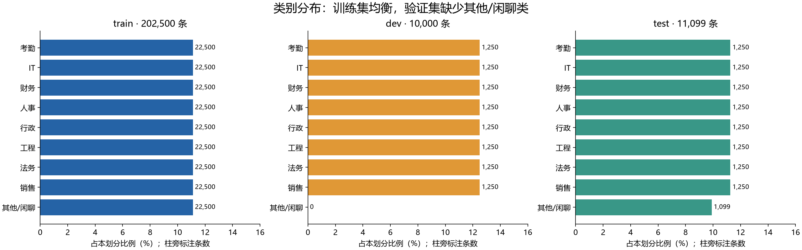
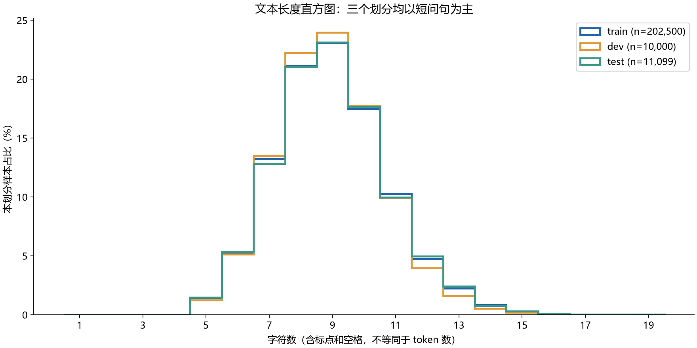
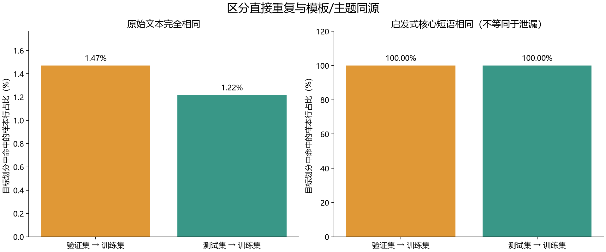
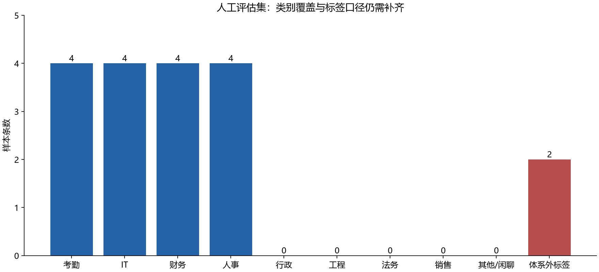

# 企业客服意图数据 EDA 报告

负责人：EvanJoy482。任务：Issue #13。分析日期：2026-09-21。

本报告基于仓库 `0f379ac` 的数据快照，分析完整 train/dev/test，无抽样、无数据修改。
输入文件 SHA-256、原始计数、运行库版本和归一化规则均保存在 [statistics.json](statistics.json)。
本次未训练或评估 BERT，不将 README 中的预期精度当作实测值。

## 结论先读

1. 训练集九类完全均衡；验证集缺失“其他/闲聊”，测试集该类也少于其他类。README 的划分条数与实际文件不符。
2. 三个划分的文本中位数均为 9 字，95% 分位数均为 12 字，主要覆盖短、模板化问句。
3. 启发式归一化后，验证集和测试集的核心短语均在训练集中出现，支持模板/主题同源风险；这不等于“100% 数据泄漏”。
4. 全部划分合计存在 1,557 种同文本异标签问题。训练/测试直接重叠的 135 条也是标签冲突，不能用它们解释模型分数升高。
5. 当前人工集仅 18 条，缺少五类，并有体系外标签；需要先补齐覆盖和统一口径，才能检验真实表达下的泛化。

答辩可直接使用 [结论页](conclusion.md)，四张 PNG 可插入 PPT。

## 1. 数据范围与统计口径

主分析对象为 `data/train.txt`、`dev.txt`、`test.txt` 和 `class.txt`；另检查
`data/eval/test_queries.jsonl` 的覆盖。知识库文档、停用词与早期 CSV 不属于本次分类划分统计。

- 每行按最后一个制表符拆分文本和标签；标签 ID 对应 `class.txt` 的零起始行号。
- 解析器遇到空行、空文本、非法标签立即报错，本次全量解析通过，未跳过任何行。
- 字符长度为 Python `len(text)`，包含空格、标点及拉丁字符，不等于 BERT token 数。
- 完全重复按原始文本判定，保留空格和标点差异。内部重复多余行 = 总行数 − 唯一文本数。
- 跨集命中率 = 目标集中原文在源集出现的行数 / 目标集总行数；标签是否一致另行统计。
- 同文本对应两个及以上标签，记为一种冲突文本。不同措辞仅共享主题不算完全重复。

## 2. 九类分布



| ID | 类别 | train | dev | test |
|---|---|---:|---:|---:|
| 0 | 考勤制度 policy_attendance | 22,500 | 1,250 | 1,250 |
| 1 | IT 支持 it_vpn | 22,500 | 1,250 | 1,250 |
| 2 | 财务报销 finance_expense | 22,500 | 1,250 | 1,250 |
| 3 | 人力资源 hr_onboarding | 22,500 | 1,250 | 1,250 |
| 4 | 行政后勤 admin_logistics | 22,500 | 1,250 | 1,250 |
| 5 | 工程设备 engineering_eq | 22,500 | 1,250 | 1,250 |
| 6 | 法务合同 legal_contract | 22,500 | 1,250 | 1,250 |
| 7 | 销售市场 sales_marketing | 22,500 | 1,250 | 1,250 |
| 8 | 其他/闲聊 other_chitchat | 22,500 | **0** | **1,099** |
| 合计 | | **202,500** | **10,000** | **11,099** |

训练集每类占 11.11%，最大/最小类比为 1，类别完全均衡。
验证集仅包含前八类，各占 12.50%，不能验证闲聊识别能力；用它选择模型也无法观察该类表现。
测试集前八类各占 11.26%，闲聊占 9.90%，最大/最小类比约 1.14，略不均衡。

README 写 dev/test 各 11,250 条，实际分别少 1,250 和 151 条，差额均对应闲聊类。
这是文件现状，尚未确认形成原因；建议数据负责人核对划分来源，不能未经确认补造数据。
评估应固定九类标签顺序，同时输出每类 support、precision、recall、F1 和 macro-F1。
缺失类的召回不可估计，不应将零分或忽略该类误解为已评估完整九类。

## 3. 文本长度



| 划分 | 均值 | 最短 | P25 | 中位数 | P75 | P95 | P99 | 最长 |
|---|---:|---:|---:|---:|---:|---:|---:|---:|
| train | 8.99 | 5 | 8 | 9 | 10 | 12 | 14 | 19 |
| dev | 8.90 | 5 | 8 | 9 | 10 | 12 | 13 | 16 |
| test | 9.00 | 5 | 8 | 9 | 10 | 12 | 14 | 19 |

直方图采用相同的整数字符分箱，并除以各划分行数，避免训练集体量掩盖其他划分。
三个划分的长度形态接近，但仅凭长度相近不能证明完整语义分布相同。
这些数据缺少较长背景描述、多意图、指代和自然口语变化的覆盖证据。
字符统计不能验证 `MAX_LEN=48` 的 token 截断率，若要讨论截断需要实际 tokenizer 分析。

## 4. 重复与标签冲突

| 划分 | 唯一文本数 | 重复多余行 | 占总行数 | 冲突文本种数 |
|---|---:|---:|---:|---:|
| train | 201,234 | 1,266 | 0.6252% | 1,266 |
| dev | 9,998 | 2 | 0.0200% | 2 |
| test | 11,095 | 4 | 0.0360% | 4 |

| 源集 → 目标集 | 命中行数 / 目标总行数 | 命中率 | 命中且标签不一致的行数 |
|---|---:|---:|---:|
| train → dev | 147 / 10,000 | 1.4700% | 147 |
| train → test | 135 / 11,099 | 1.2163% | 135 |
| dev → test | 3 / 11,099 | 0.0270% | 3 |

此处命中行数也恰好等于跨集交集中的唯一文本数。全量合并后有 **1,557 种**冲突文本。
直接重复不代表同标签答案泄漏：本次所有跨集命中文本的目标标签都不在源文本标签集合中。
例如下列原文在 train 和 test 中完全一致：

| 原文 | train 标签 | test 标签 |
|---|---|---|
| 病假工资审批谢谢啦 | 人力资源（3） | 考勤制度（0） |
| 咱加班费计算哈 | 财务报销（2） | 考勤制度（0） |
| 合同模板流程? | 法务合同（6） | 销售市场（7） |

这类样本体现业务边界模糊或标注规则不一致，可形成不可由文本单独消除的歧义，并干扰训练与评估。
不能将其说成推高准确率的证据。处理上应先由业务规则确定归属，或补充上下文/设置澄清策略，
再按文本分组划分数据；不应为得到更好分数直接删除测试难例。

## 5. 模板规律与同源风险

观察样本可归纳为：`[开场语] + [提问引导] + 核心业务短语 + [询问方式] + [礼貌词/标点]`。
如“打扰了”“请问”“想了解下”反复出现，“怎么申请”“流程”“谢谢啦”反复作为结尾；
“你好你好”“请问请问”这样的叠加也出现在实际样本中。

分析脚本按最长短语优先、仅在首尾迭代剥离，规则完整记录在 JSON 中。规则来自样本观察，
未取得原生成器的模板 ID，因此称为**启发式核心短语归一化**，不称为恢复出的真实模板。
它会合并“报销流程”“报销审批”等可能存在业务差异的表达，不能用于自动重标注或作为泄漏率。

| 归一化核心 | 不同原文数（全划分） | train 行数 | dev 行数 | test 行数 |
|---|---:|---:|---:|---:|
| 报销 | 779 | 705 | 39 | 35 |
| 加班费计算 | 573 | 693 | 44 | 34 |
| 育儿假 | 568 | 702 | 46 | 32 |
| 合同模板 | 550 | 688 | 44 | 37 |
| 合同扫描 | 425 | 376 | 22 | 27 |

例如“你好你好报销审批”“你好你好报销审批谢谢啦”“你好关于报销审批”均归为“报销”；
“你好合同模板”“你好合同模板?”“你好合同模板~”均归为“合同模板”。这些均为真实数据原文。
同一核心的原文种数可少于行数，因为原文可能以不同标签重复出现。



训练集归一化后有 2,845 种核心短语，验证集 1,095 种，测试集 1,727 种。
验证集 **10,000/10,000** 行和测试集 **11,099/11,099** 行的归一化核心均在训练集出现。
这说明在当前规则下，测试集主要检查已见主题在相似组合表达中的识别能力，
对未见主题和真实表述的检验有限。主题相同本身合理；问题在于不能把这种受限测试直接外推为业务泛化。

**为什么可能出现虚高的业务预期：**模板组合同时进入训练和测试，模型可学习固定关键词与组合模式，
在同源合成测试集获得高分，但自然问句可能具有不同语序、错别字、隐含意图或多业务交叉，性能未必保持。
这是依据数据结构提出的风险判断，未做跨域模型对照实验，不能报告“BERT 已虚高 X 个百分点”。
跨集标注冲突是另一个问题，可能拉低或扰动分数，需要与模板泛化风险分开讨论。

## 6. 为什么需要人工评估集



当前 `data/eval/test_queries.jsonl` 有 18 条，考勤、IT、财务、人事各 4 条，另有 2 条
`out_of_scope`；后者不在 `class.txt` 九类体系中。行政、工程、法务、销售、其他/闲聊均缺失。
18 条原文均未在训练集完全出现，但这不等于语义独立或已经足以验证真实业务水平。

人工集的价值是提供脱离合成句式的测试证据。建议评估组：

1. 按全员每人 10 条汇总并扩充至 100+ 条，检查九类覆盖；100 条仍只适合初步评估，每类少量错误会明显改变指标。
2. 独立撰写自然问句，覆盖长背景、口语、省略、错别字、否定和跨部门歧义，避免照抄模板或训练原文。
3. 先统一标签说明，对“加班费”“合同”等交叉主题复核。`out_of_scope` 是拒答/越权边界，不能未经约定直接改成闲聊。
4. 将有效九分类问句和体系外/拒答用例分别评估。保留体系外用例的用途说明，不能静默丢弃或混入九分类准确率。
5. 冻结人工测试集，不用其反复选模型或调提示词；另外设置开发样例。对同一权威模型并列报告合成集/人工集 acc、macro-F1、每类 support 和 badcase。
6. 在修正冲突标签后，补做按已确认模板族或业务主题分组的划分实验，检查未见组合/主题下的泛化；明确这比随机划分更难、回答的是不同问题。

## 7. 复现与交付

环境：Python 3.11.16、numpy 2.4.6、matplotlib 3.11.2、pytest 9.1.1。
分析不加载 torch、BERT 权重或 API，也不需要 GPU。仅安装 EDA 和测试依赖即可：

```powershell
uv venv --python 3.11 .venv
uv pip install --python .venv/Scripts/python.exe numpy==2.4.6 matplotlib==3.11.2 pytest==9.1.1
uv run --no-sync python -m pytest -q
uv run --no-sync python -m src.eda
```

已安装完整项目依赖时也可直接运行 `python -m src.eda`。
图表需要微软雅黑、黑体、Noto Sans CJK SC 或文泉驿正黑字体之一。
无随机抽样，统计结果确定；字体与 matplotlib 版本可能影响图片像素表现。
脚本重新生成 JSON 和四张 PNG；本报告与结论页为针对当前快照的人工解释，数据更新后须核对哈希并同步改写。
测试覆盖解析异常、文本原样保留、缺失类别、重复率分母、标签冲突和边界归一化。

| 文件 | 用途 |
|---|---|
| `README.md` | 完整 EDA 报告 |
| `conclusion.md` | 答辩结论页与口述稿 |
| `statistics.json` | 全量计数、规则、实例及输入哈希 |
| `class_distribution.png` | 三个划分的类别分布 |
| `length_histogram.png` | 字符长度直方图 |
| `overlap_comparison.png` | 完全重复与启发式核心覆盖对比 |
| `human_coverage.png` | 人工评估集类别覆盖 |

复现代码位于 `src/eda.py`，验证代码位于 `tests/test_eda.py`。
本交付只记录数据现状及建议，不修改原始数据、标签、模型或他人负责的训练评估实现。
